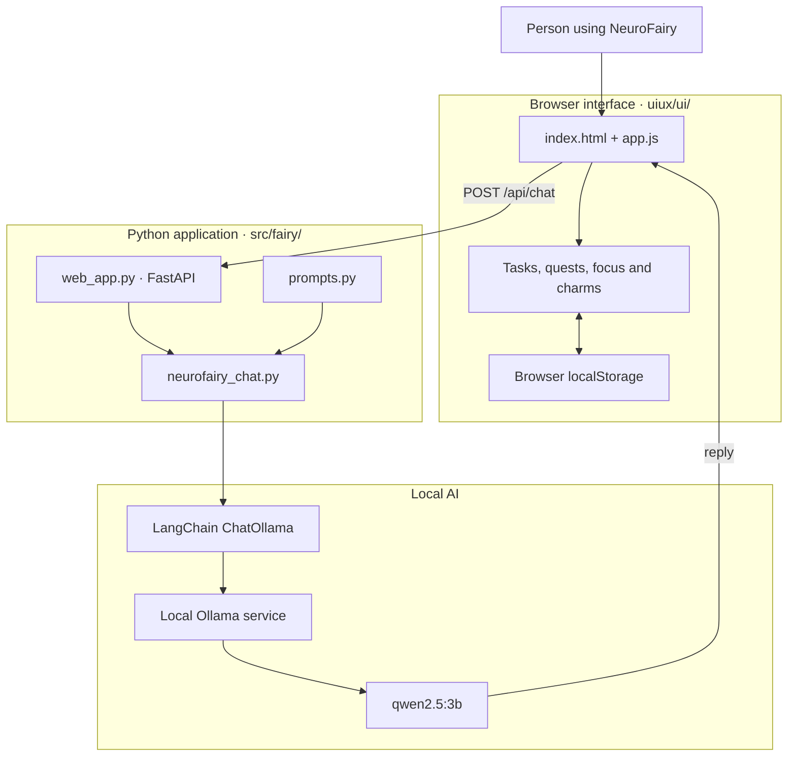

# NeuroFairy

An ADHD aware executive functioning agent. 

Status: **Stage 1 — in progress.**

## What this is

NeuroFairy is a cute, pixlated local AI assistant that floats on your desktop (and in lives in a fairy cottage web app), helping you organize and simplify tasks, focus time, calendar, notes etc. Inspired by researched executive functioning tecniques such as body doubling, pomodoro timers, and brain dumping. 

(I formatted the build docs like a course to help strengthen my own AI and SWE skills!)

## Tech Stack (so far)
Python 3, SQLite, CSS - frontend, Ollama (Qwen2.5:3), Langchain, FastMCP

## Current Runtime Architecture

## Progress Photos - Sept 20th, 2026

## License

MIT
