# NeuroFairy architecture map

This document is the visual companion to the [follow-along curriculum](README.md). It
shows what is connected today, what the final Mac-first product is intended to become,
and which architectural slice each build stage adds.

Use the status written inside each diagram node:

- **Implemented** means the code exists in this repository now.
- **Prototype** means the browser demonstrates the interaction, but the state or backend
  behavior is not yet a product feature.
- **Planned** means it belongs to an approved later stage.
- **Future optional** means it is outside the required V1 path.

The diagrams describe system structure, not visual styling. Fairy art, colors,
typography, animation, and final Fairy Home styling will be supplied separately. This
document does not create or infer a `design.md`.

**Quick read:** [product overview](#1-the-product-in-one-picture) ·
[current connections](#2-what-is-connected-today) · [target V1](#3-target-v1-architecture) ·
[stage-by-stage product](#8-what-the-product-looks-like-at-each-stage)

---

## 1. The product in one picture

NeuroFairy is one local product with two user surfaces. The small desktop Fairy keeps help
reachable while the larger Fairy Home gives planning, review, and settings more room.

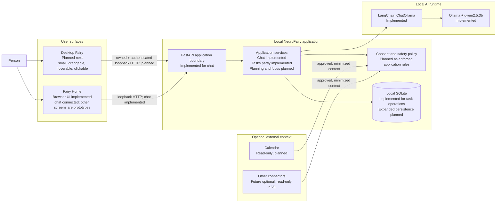

The desktop Fairy and Fairy Home should not grow separate product logic. Both call the
same local API and application services. The desktop surface stays intentionally small;
Fairy Home handles interactions that need more space.

---

## 2. What is connected today

### Working chat path

This is the verified vertical slice in the repository now.

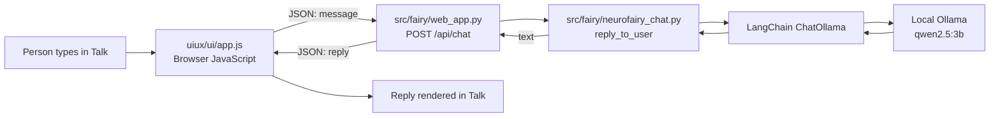

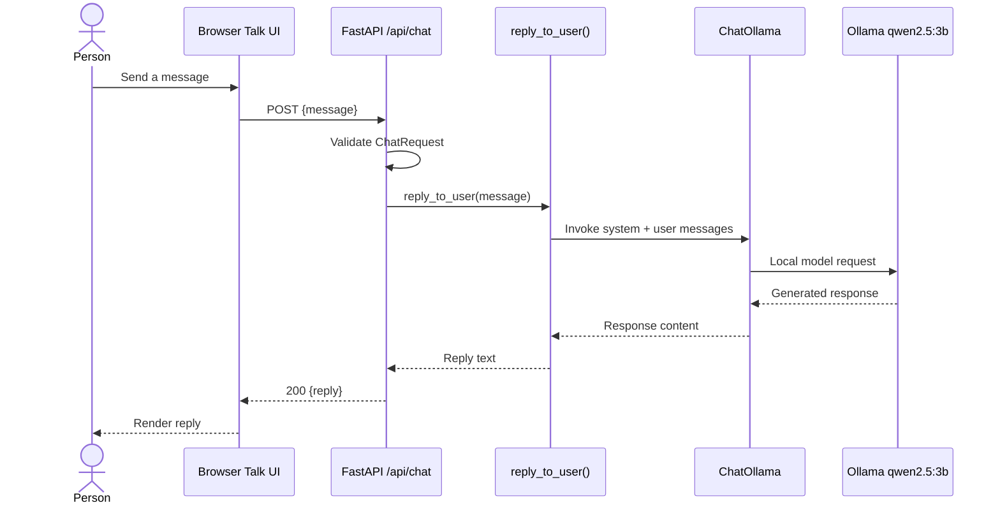

### Separate task/MCP path

Task operations exist, but the browser UI and chat model do not use them yet.

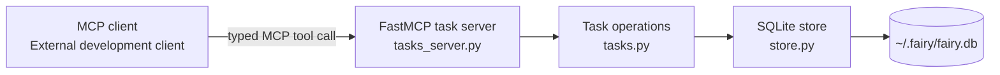

### Browser prototype state

These screens are useful product references, but most of their non-chat state is isolated
inside the browser today.

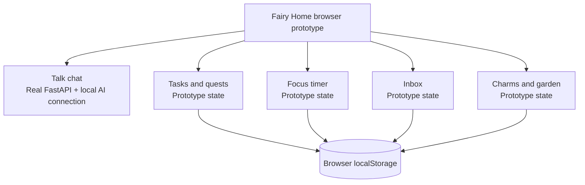

The two storage locations are not synchronized. A task created through MCP does not
automatically appear in the browser prototype, and a browser quest does not automatically
appear in SQLite.

---

## 3. Target V1 architecture

The target keeps one local source of truth and puts narrow boundaries around AI and
external providers.

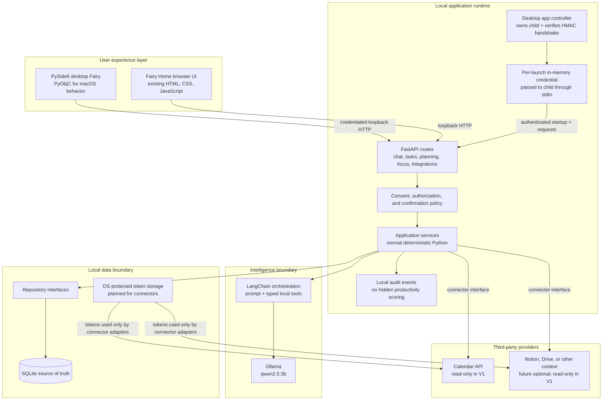

### Recommended process boundary

For the final local product, the desktop application owns a distinct backend lifecycle:

1. Generate a high-entropy per-launch credential in memory.
2. Start one child process and pass the credential through standard input, never through
   command-line arguments.
3. Let the child bind an OS-assigned `127.0.0.1` port and return an HMAC-protected startup
   handshake.
4. Enable desktop chat only after the parent verifies the handshake and an authenticated
   health check.
5. Send the credential on desktop health/chat requests and clear it when the child exits.
6. Shut down only that stored child process.

This keeps product rules in one place and avoids letting the desktop UI call Ollama or
SQLite directly. The browser-development command remains a separate open loopback process;
the desktop neither discovers nor reuses it. Loopback binding limits exposure, but the
authenticated handshake proves which child receives private desktop chat.

---

## 4. Tech stack and responsibilities

| Layer | Technology | Status | Responsibility |
|---|---|---|---|
| Desktop surface | PySide6 | Planned next | Floating window, popover, hover and click interactions |
| macOS bridge | PyObjC | Planned next | Native window behavior and macOS-specific affordances |
| Fairy Home | HTML, CSS, JavaScript | Implemented/prototype | Larger browser workspace; chat works now |
| Local API | FastAPI + Uvicorn | Implemented for chat | Validated HTTP boundary shared by both surfaces |
| Schemas | Pydantic | Implemented/expands by stage | Validate API, tool, connector, and model-boundary data |
| Application logic | Python services | Partly implemented | Deterministic product operations independent of UI |
| AI orchestration | LangChain | Implemented for chat | Prompt/model boundary now; typed tool selection later |
| Local model adapter | `langchain-ollama` | Implemented | Connect LangChain to the local Ollama runtime |
| Local model | Ollama `qwen2.5:3b` | Implemented | Generate conversational responses locally |
| Persistence | SQLite | Implemented for tasks | Durable local source of truth, expanded incrementally |
| Interoperability | FastMCP | Implemented for tasks | Optional typed access for compatible development clients |
| External access | OAuth + narrow connector adapters | Planned | Revocable, read-only context access in V1 |
| Tests and quality | pytest + Ruff | Implemented | Deterministic behavior checks and code quality gates |
| Project management | `uv` + `pyproject.toml` + `uv.lock` | Implemented | Reproducible Python environment and commands |

### One responsibility per boundary

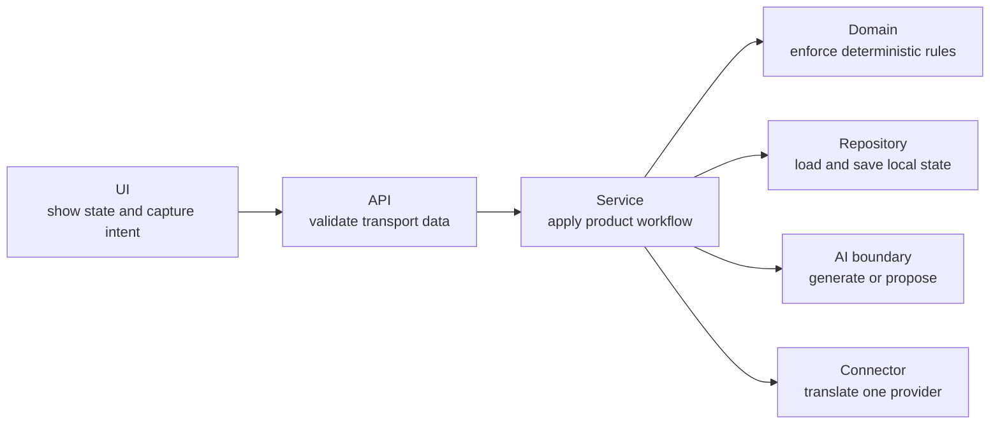

Routes should not contain the whole product workflow. Models should not receive database
connections, raw OAuth tokens, or unrestricted provider clients. UIs should not implement
separate copies of planning or safety rules.

---

## 5. Communication patterns

### Desktop chat after Stage 2

```mermaid
sequenceDiagram
    actor Person
    participant Fairy as Desktop Fairy
    participant Child as Owned backend child
    participant API as Authenticated FastAPI app
    participant Chat as Chat service
    participant Model as Local Ollama model

    Fairy->>Fairy: Generate per-launch credential
    Fairy->>Child: Start child; send credential through stdin
    Child-->>Fairy: OS-assigned port + HMAC proof
    Fairy->>Fairy: Verify proof
    Fairy->>API: GET /api/health + credential
    API-->>Fairy: Authenticated healthy response
    Person->>Fairy: Click Fairy and send message
    Fairy->>API: POST /api/chat + credential
    alt Owned child is alive and authenticated
        API->>Chat: Validate and request reply
        Chat->>Model: Local generation
        Model-->>Chat: Response
        Chat-->>API: Reply
        API-->>Fairy: {reply}
        Fairy-->>Person: Show concise response
    else Backend is unavailable
        Fairy-->>Person: Show calm local recovery state
    end
```

The desktop Fairy reuses the `/api/chat` application contract; it does not reuse an
unidentified process, create a second prompt, or make a direct model connection.

### Safe local tool execution after Stage 6

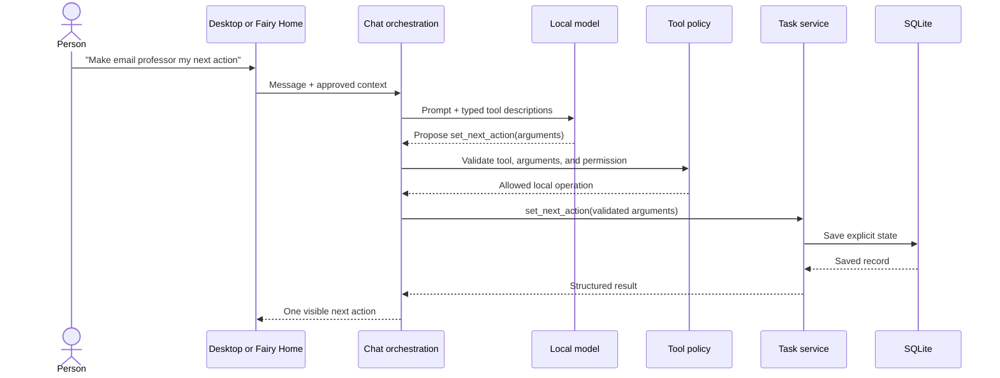

The model proposes; deterministic application code validates and executes. A malformed,
unknown, excessive, or disallowed tool request becomes a safe failure instead of an
unrestricted action.

### External write rule

V1 connectors are read-only. The architecture may preserve a future confirmation boundary,
but no email, calendar event, Notion page, Drive file, or external task may be created,
edited, or deleted in V1.

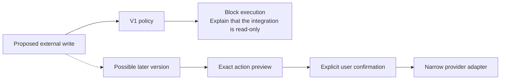

---

## 6. Integration and privacy architecture

External context crosses a deliberately narrow path. OAuth credentials remain outside the
model prompt, and the model receives only the fields needed for the current user-approved
operation.

```mermaid
flowchart LR
    PERSON["Person"]
    CONSENT["Consent screen<br/>scope, purpose, disconnect"]
    OAUTH["Provider OAuth<br/>read-only scope"]
    TOKENS["OS-protected token storage"]
    ADAPTER["Provider-specific adapter"]
    NORMALIZE["Normalized source items<br/>time, title, provenance"]
    FILTER["Data minimization and policy filter"]
    CONTEXT["Approved context packet"]
    PLAN["Planning or chat service"]
    MODEL["Local model"]

    PERSON --> CONSENT
    CONSENT --> OAUTH
    OAUTH --> TOKENS
    TOKENS --> ADAPTER
    ADAPTER --> NORMALIZE
    NORMALIZE --> FILTER
    CONSENT --> FILTER
    FILTER --> CONTEXT
    CONTEXT --> PLAN
    PLAN --> MODEL
```

### Connector contract

Each connector should expose normalized, provenance-carrying data rather than leak a
provider's response format into the rest of the app.

```text
Provider API
  → provider adapter
  → validated normalized item
  → consent and minimization filter
  → application service
  → optional local-model context
```

Required properties:

- Request the narrowest read-only scope.
- Explain what will be read and why before authorization.
- Make disconnect and revocation easy to find.
- Keep tokens out of prompts, logs, UI state, and SQLite domain records.
- Attach source and refresh time to imported context.
- Handle expired authorization without losing local user data.
- Never imply that stale context is current.

### Integration roadmap

| Integration | V1 role | Direction | Stage |
|---|---|---|---|
| Ollama | Local conversational model | Local request and response | Implemented |
| SQLite | Local product state | Local read and write | Tasks implemented; expands in Stages 3–5 |
| FastMCP | Optional task interoperability | Typed local calls | Implemented for task operations |
| Calendar | Time constraints and buffers | External read only | Stage 7 |
| Notion | Optional reference context | External read only | Future optional |
| Google Drive | Optional reference context | External read only | Future optional |
| Gmail or other email | Optional message context | External read only | Future optional; sending is out of scope |

The first calendar provider and its exact scopes must be chosen and documented during
Stage 7. Do not request credentials or implement OAuth while earlier stages are still in
progress.

---

## 7. Data ownership and source of truth

| Data | Source today | Target source | Used by |
|---|---|---|---|
| Chat request/reply | In-memory request lifecycle | Local request lifecycle; optional consented history later | Browser and desktop chat |
| Task records | SQLite through task operations | Shared SQLite repositories and services | Desktop, Fairy Home, optional MCP |
| Browser quests/inbox | Browser `localStorage` prototype | Shared SQLite domain records after explicit migration | Fairy Home and desktop summaries |
| Focus state | Browser `localStorage` prototype | Tested Python focus service + SQLite session records | Desktop and Fairy Home |
| Daily plan | Prototype UI state | Structured local plan with Anchor/Quest/Maintenance/Optional items | Planning UI and next-action status |
| Charms/garden | Browser `localStorage` prototype | Deferred local persistence | Fairy Home |
| Connector tokens | None | OS-protected secret storage | Connector adapters only |
| Imported calendar context | None | Minimal local cache only if needed, with provenance and expiry | Planning service |

### Target ownership rule

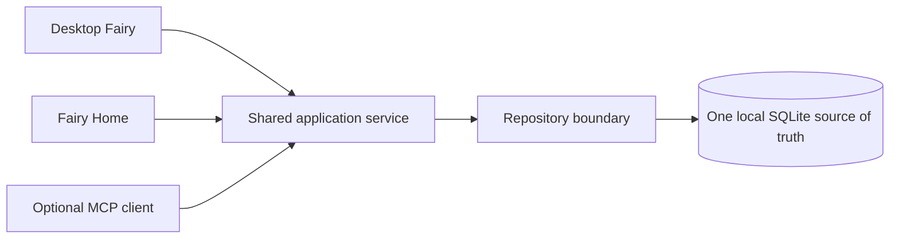

`localStorage` can remain useful for purely visual preferences, but not as a second source
of truth for tasks, plans, focus sessions, or consent decisions.

---

## 8. What the product looks like at each stage

```mermaid
flowchart LR
    S1["1 · Foundation<br/>Working browser chat is protected"]
    S2["2 · Desktop Fairy<br/>Help is reachable above other apps"]
    S3["3 · Shared tasks<br/>One real next action everywhere"]
    S4["4 · Daily planning<br/>Brain dump becomes a realistic plan"]
    S5["5 · Focus support<br/>Gentle body doubling and return"]
    S6["6 · Safe tools<br/>AI can propose bounded local actions"]
    S7["7 · Calendar context<br/>Plans respect real time and buffers"]
    S8["8 · Pilot ready<br/>Accessible, evaluated, non-punitive"]

    S1 --> S2 --> S3 --> S4 --> S5 --> S6 --> S7 --> S8
```

| Stage | What the user can see and do | Architectural increment | Proof before moving on |
|---|---|---|---|
| 1. Existing local app foundation | Open Fairy Home, send a real message, receive a local-model reply | Characterization tests and accurate docs around the existing browser → FastAPI → Ollama path | Deterministic route tests, full test run, clean lint/format, live smoke test |
| [2. Desktop Fairy companion](stage-2-desktop-fairy.md) | See a small always-reachable Fairy, drag it, hover for a short status, click to chat | PySide6/PyObjC surface plus an owned child, per-launch credential, authenticated handshake, and the same FastAPI chat contract | macOS interaction checklist, geometry tests, forged-handshake/auth tests, backend failure recovery |
| 3. Internal tasks and next actions | Create a task and see one recommended next visible action from either surface | Shared domain model, service, repository, SQLite migration, API route; MCP becomes an adapter to the same service | Service/API/repository tests and cross-surface persistence check |
| 4. Brain dump and realistic planning | Enter a brain dump, answer at most one clarifying question, review an Anchor/Quest/Maintenance/Optional plan | Structured planning schemas, deterministic capacity rules, local-model extraction behind validation | Fixture-based planning tests plus overload and ambiguity cases |
| 5. Gentle focus and body doubling | Start, pause, resume, complete, abandon, or re-plan without penalty | Shared Python focus state machine, persisted sessions, desktop status, browser detail view | State-transition tests, restart recovery, manual desktop/browser check |
| 6. Safe LangChain tools | Ask naturally for bounded local task/plan/focus changes | Typed tool registry, validation, policy limits, audit events, safe fallback | Allowed/blocked/malformed tool tests; model never gets raw storage access |
| 7. Read-only calendar and privacy | Connect a calendar, review approved context, and build around fixed commitments and buffers | OAuth, protected token storage, normalized connector boundary, provenance and revocation | Scope review, expired-token tests, disconnect check, no external writes |
| 8. Charms, evaluation, and pilot readiness | Receive optional non-punitive rewards and use an accessible, testable pilot | Deferred reward persistence, model-quality evaluation, accessibility and packaging checks | Safety/evaluation suite, accessibility review, pilot checklist |

### Product surface by stage

```mermaid
flowchart TB
    subgraph Stage1["Stage 1 · Today"]
        A1["Fairy Home Talk"] --> A2["Real local AI reply"]
    end

    subgraph Stage2["Stage 2"]
        B1["Floating Fairy"] --> B2["Hover status"]
        B1 --> B3["Click-to-chat popover"]
        B3 --> B4["Same local AI reply"]
    end

    subgraph Stages3to5["Stages 3–5"]
        C1["One next action"] --> C2["Reviewable daily plan"]
        C2 --> C3["Gentle focus session"]
        C3 --> C4["Explicit outcome and return"]
    end

    subgraph Stages6to8["Stages 6–8"]
        D1["Natural language requests"] --> D2["Validated local tools"]
        D3["Approved calendar context"] --> D4["More realistic plan"]
        D4 --> D5["Accessible pilot + optional charms"]
    end
```

---

## 9. Final user journey

The final architecture exists to support this calm loop, not to maximize automation.

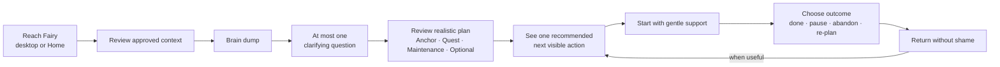

System behaviors that must remain true throughout the journey:

- The person can always reach chat.
- Plans protect transitions, buffers, rest, and actual capacity.
- Focus support is body doubling, not surveillance.
- One visible next action is preferred over a giant generated list.
- The user explicitly chooses outcomes; the system does not infer effort or moral worth.
- The product gives no diagnosis, medication advice, medical care, or crisis care.

---

## 10. Decisions, open questions, and non-goals

### Decisions already made

- `code/fairy` is the source repository; the older Swift/SwiftUI/Xcode prototype is not an
  implementation dependency and will not be revived.
- Mac-first local product with a desktop Fairy and Fairy Home.
- Existing Python/FastAPI/LangChain/Ollama stack remains the application foundation.
- PySide6 + PyObjC is the approved desktop direction.
- Both user surfaces share application services instead of duplicating behavior.
- SQLite is the local durable store.
- Third-party integrations are read-only in V1.
- MCP is an optional interoperability adapter, not a required hop inside every workflow.

### Questions each stage must answer with a small tested decision

- Stage 2: how the packaged desktop app starts, health-checks, and stops its local backend.
- Stage 3: the migration path from browser prototype state to shared domain records.
- Stage 4: exactly which plan rules are deterministic and which extraction steps use AI.
- Stage 6: which local tools are necessary and what their per-call limits are.
- Stage 7: the first calendar provider, exact read-only scopes, token storage mechanism,
  cache policy, and disconnect behavior.
- Stage 8: which quality metrics are useful without becoming covert productivity scores.

### Not part of V1

- Sending email or messages
- Editing external calendars, Notion, Drive, or task systems
- Hidden productivity scores or passive activity surveillance
- Punitive streaks, leaderboards, or shame-based reminders
- An autonomous agent with unrestricted tools
- Cloud accounts or cross-device sync
- Therapy, diagnosis, medication guidance, medical care, or crisis care
- Final visual direction before the owner supplies it

---

## How to use this map while building

At the start of a stage, locate its new box or connection in this document. At the end of
the stage:

1. Verify the code and tests.
2. Change only the affected status labels from planned/prototype to implemented.
3. Update the matching data-ownership and integration rows.
4. Keep future boxes visibly future.
5. Record architectural decisions in the relevant stage document before beginning the
   next stage.

That keeps the diagrams honest: they describe the product that exists, while still making
the destination visible.
